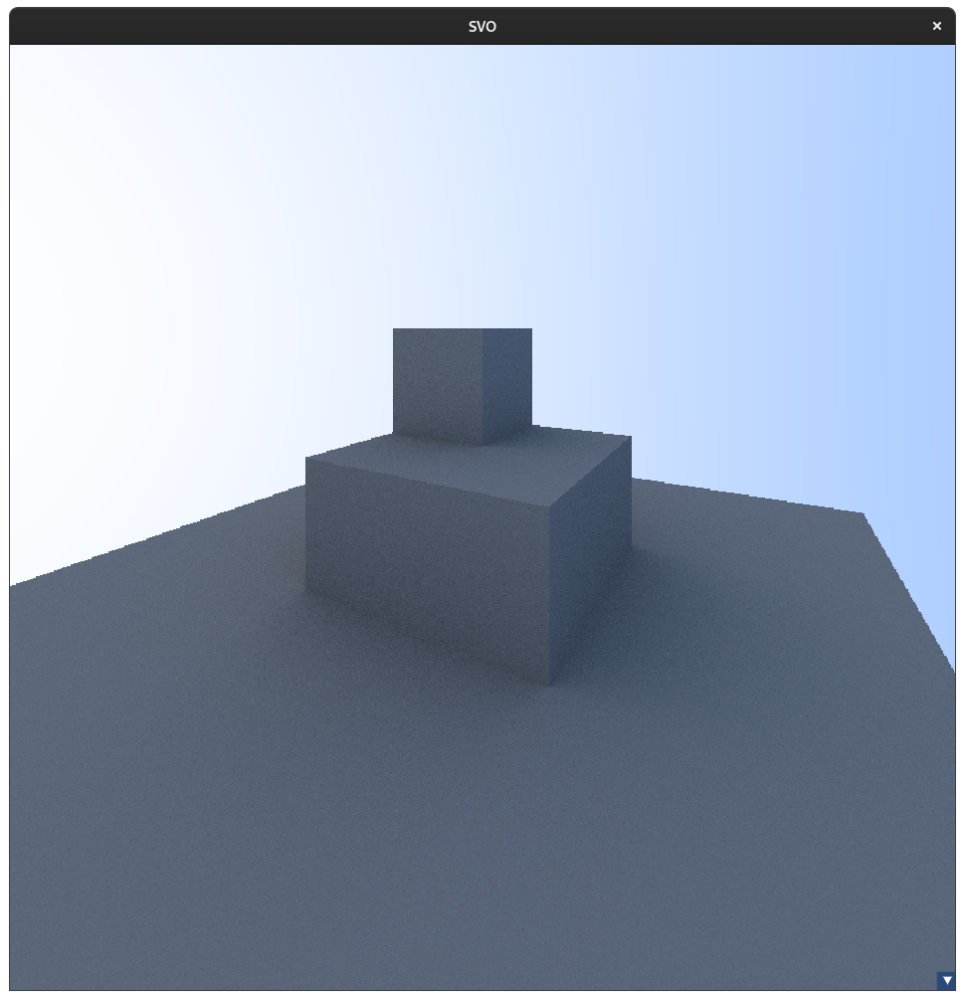
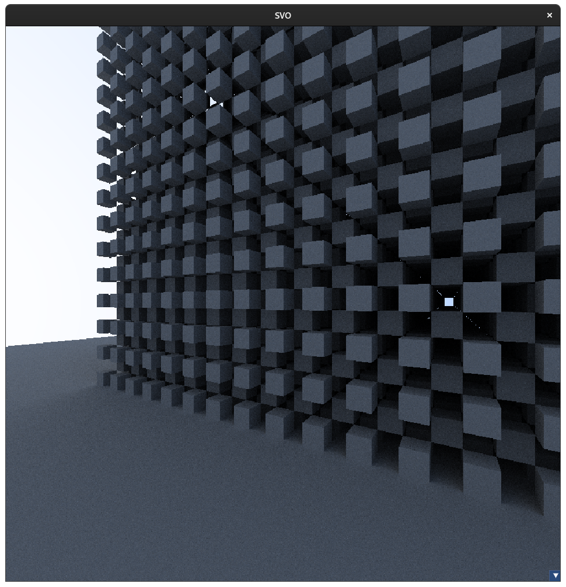

# Sparse-Voxel-Octree
This project implements rendering a Sparse Voxel Octree on the CPU with path tracing. OpenGL, GLFW and ImGUI are used for the window, ui, and displaying of the rendering.
All rendering calculations are done on the CPU and written to a texture. Currently, the path tracing is fairly primitive as I learn but can produce some great results. [Reference](https://raytracing.github.io/books/RayTracingInOneWeekend.html)

## Media

Demonstration with 12 samples + 12 bounces

Results with 50 samples + 50 bounces

## Further Work

* Import models and voxelize them into the SVO data-structure
* Add lights to the scene
* Render on GPU using OpenCL
* Save resulting image
* Render time estimates
